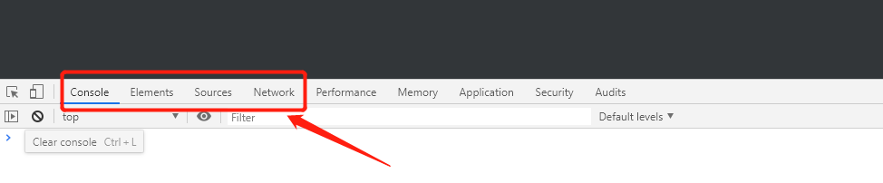
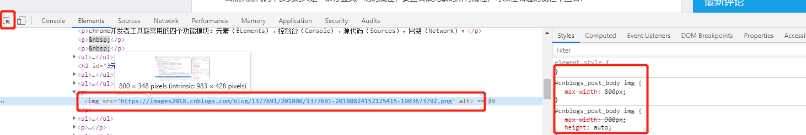
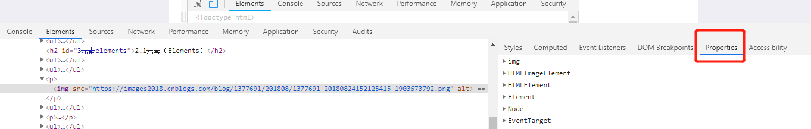
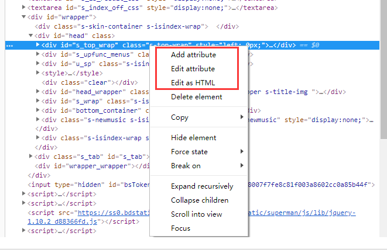
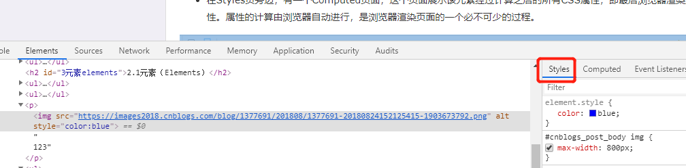
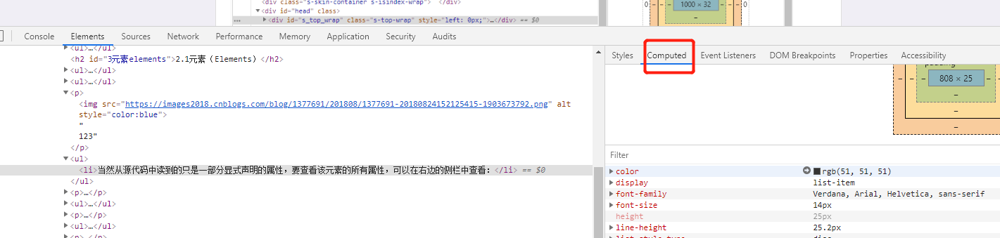

# Chrome浏览器F12开发者工具简单使用

## 1.如何调出开发者工具

```
右键检查（或快捷键Ctrl+Shift+i）调出 
```

## 2.开发者工具初步介绍



```
chrome开发者工具最常用的四个功能模块：元素（ELements）、控制台（Console）、源代码（Sources），网络（Network）。
```

1. 元素（Elements）：用于查看或修改HTML元素的属性、CSS属性、监听事件、断点等。css可以即时修改，即时显示。大大方便了开发者调试页面

2. 控制台（Console）：控制台一般用于执行一次性代码，查看JavaScript对象，查看调试日志信息或异常信息。还可以当作Javascript API查看用。例如我想查看console都有哪些方法和属性，我可以直接在Console中输入"console"并执行~

3. 源代码（Sources）：该页面用于查看页面的HTML文件源代码、JavaScript源代码、CSS源代码，此外最重要的是可以调试JavaScript源代码，可以给JS代码添加断点等。

4. 网络（Network）：网络页面主要用于查看header等与网络连接相关的信
息。


### 2.1元素（Elements）

1. 查看元素的代码：点击左上角的箭头图标（或按快捷键Ctrl+Shift+C）进入选择元素模式，然后从页面中选择需要查看的元素，然后可以在开发者工具元素（Elements）一栏中定位到该元素源代码的具体位置

2. 查看元素的属性：定位到元素的源代码之后，可以从源代码中读出改元素的属性。如下图中的class、src、width等属性的值。



3. 当然从源代码中读到的只是一部分显式声明的属性，要查看该元素的所有属性，可以在右边的侧栏中查看:



4. 修改元素的代码与属性：点击元素，然查看右键菜单，可以看到chrome提供的可对元素进行的操作：包括编辑元素代码（Edit as HTML）、修改属性（Add attribute、Edit attribute）等。选择Edit as HTML选项时，元素进入编辑模式，可以对元素的代码进行任意的修改。当然，这个修改也仅对当前的页面渲染生效，不会修改服务器的源代码，故而这个功能也是作为调试页面效果而使用。



5. 查看元素的CSS属性：在元素的右边栏中的styles页面可以查看该元素的CSS属性，这个页面展示该元素原始定义的CSS属性以及从父级元素继承的CSS属性。从这个页面还可以查到该元素的某个CSS特性来自于那个CSS文件，使编码调试时修改代码变得非常方便。



6. 在Styles页旁边，有一个Computed页面，这个页面展示该元素经过计算之后的所有CSS属性，即最后浏览器渲染页面时使用的属性。属性的计算由浏览器自动进行，是浏览器渲染页面的一个必不可少的过程。



7. 修改元素的CSS属性：在元素的Styles页面，可以对元素的CSS属性进行修改，甚至删除原有、添加新属性。不过，这些修改，仅对当前浏览器的页面展示生效，不会修改CSS源代码。所以在这里进行CSS属性的修改一般用来调整和完善元素的渲染效果。


8. 给元素添加断点：在元素的右键菜单中选择断点选项（Break on…），选中之后，当元素被修改（通常是被JS代码修改）时，页面加载会暂停，然后可以查看该元素的属性。

